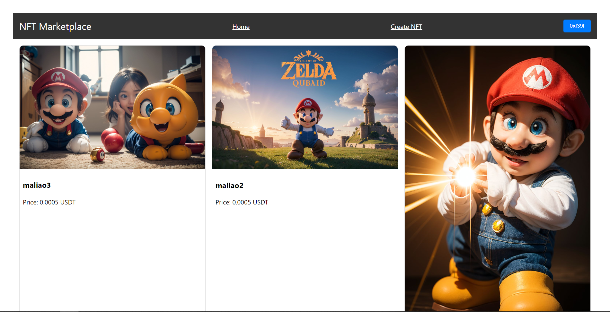
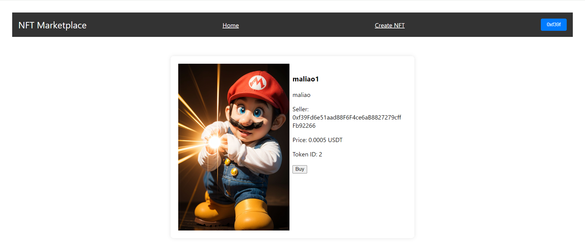
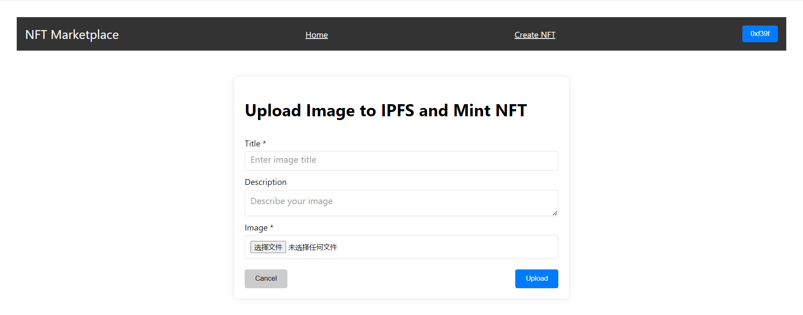
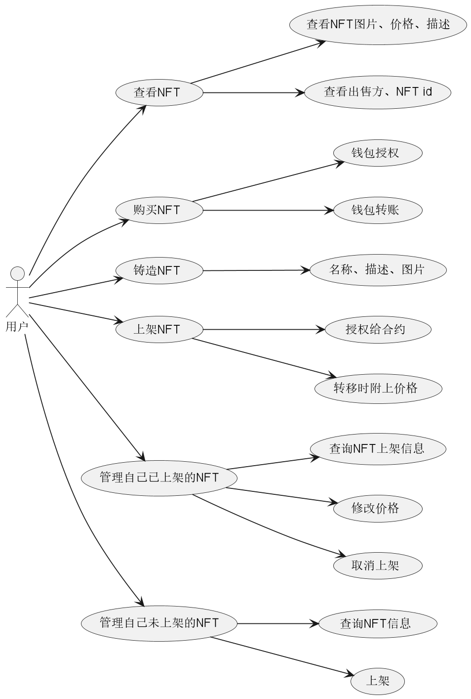
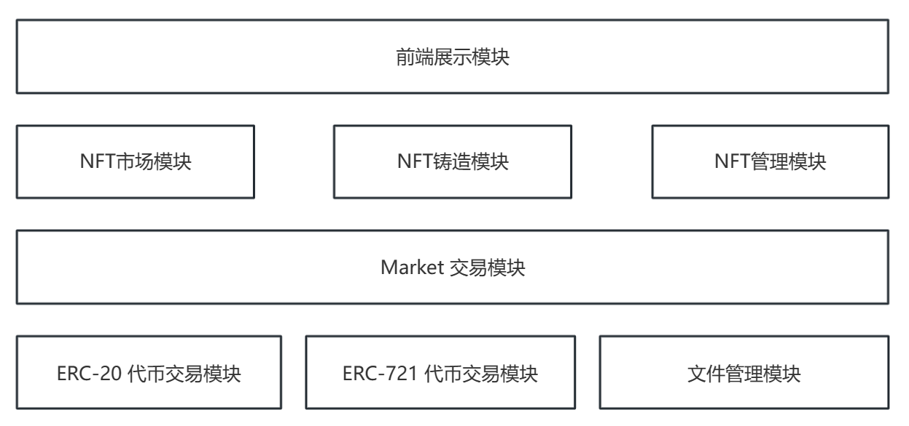
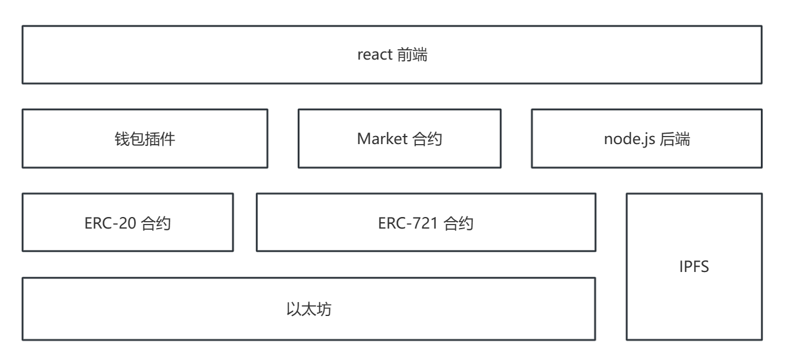

# 项目总览展示

## 前端展示

### 首页



### 详情



### 铸造页面

## 地址

- [NFT 交易市场项目合约](https://github.com/Mister-Bugs/NFT-Market)

- [NFT 交易市场项目后端](https://github.com/Mister-Bugs/NFT-market-backend)

- [NFT 交易市场项目前端](https://github.com/Mister-Bugs/NFT-market-frontend)

# 一、需求描述

`NFT`是非同质化代币，是区块链上的唯一数字资产，吸引了艺术家、游戏开发者和投资者的兴趣，市场呈爆发式增长。

`NFT`交易市场的目的是在数字领域建立一个安全、透明、多样化的交易平台，满足数字创作者、收藏家和投资者的需求，促进数字资产交易的发展和繁荣。

实现一个基础的 NFT 交易平台，用户可以进行 NFT 上架、下架、修改价格、买入、查询等基础功能。

需求描述：

- 钱包绑定小狐狸钱包地址；
- 自己铸造`NFT`，定义`NFT`的名称、描述和图片，文件在`IPFS`中保存，`mint`时只包含`NFT`的元数据，`json`格式；
- 首页展示市场中所有的`NFT`，点击跳转页面查看详情，在详情页面可以进行购买；
- 智能合约提供购买、上架、修改价格、取消订单、删除、查询等功能（便于后期开发）；

# 二、用例分析



# 三、整体方案

## 3.1 应用框架



## 3.2 技术框架



- 前端通过钱包完成与`ERC-20`和`ERC-721`合约进行交互；

# 四、核心设计

## 4.1 合约设计

### 4.1.1 ERC-20 合约

使用`@openzeppelin/contracts/token/ERC20/ERC20.sol`，为了方便，印发1亿枚`token`给发行者；币的名称为`BBB`。

### 4.1.2 ERC-721 合约

使用`@openzeppelin/contracts/token/ERC20/ERC721.sol`；

~~~solidity
contract MyNFT is ERC721, ERC721Enumerable, ERC721URIStorage, Ownable{
	//代币名称为NFTM
	//id保证其唯一性，代币绑定URL作为其价值的体现
}
~~~

### 4.1.3 Market 合约

#### 4.1.3.1 成员变量

- `IERC20 public immutable erc20;` 和 `IERC721 public immutable erc721;`

  这两个成员变量用于存储 ERC20 和 ERC721 合约的地址。在合约部署时通过构造函数初始化，然后在合约的其他地方可以使用这些合约的功能，例如转账代币或转移 NFT。

- `mapping(uint256 => Order) public orderOfTokenId;`

  这个映射用于将每个 NFT 的 tokenId 映射到相应的订单。当用户将 NFT 发送到合约时，会创建一个新订单，并将订单信息存储在这个映射中。这样，其他用户可以查询某个 tokenId 对应的订单，或者检查某个 tokenId 是否已经被上架。

- `Order[] public orders;`

  这个动态数组存储了所有订单。每当创建新订单或取消订单时，都会更新这个数组。这样做的好处是可以方便地遍历所有订单，或者查找特定的订单。

- `mapping(uint256 => uint256) public orderIndexOfTokenId;`

  这个映射将 tokenId 映射到订单在数组中的索引。这个映射的作用是为了维护订单列表 `orders` 和订单映射 `orderOfTokenId` 之间的一致性。通过 tokenId 可以直接查找到订单在数组中的位置，从而可以操作数组中的订单。

#### 4.1.3.2 成员函数

##### 4.1.3.2.1 构造函数

**参数**：

- _erc20：ERC20 合约地址。
- _erc721：ERC721 合约地址。

**逻辑**：初始化 ERC20 和 ERC721 合约地址：将传入的 ERC20 和 ERC721 合约地址存储在相应的成员变量中。

##### 4.1.3.2.2 购买 NFT

**参数**：

- tokenId：购买的 NFT 的 tokenId。

**逻辑**：

1. 确保 tokenId 对应的 NFT 已经上架：检查订单映射中是否存在 tokenId 对应的订单，如果不存在，则表示该 NFT 尚未上架，购买失败。
2. 获取订单信息：从订单映射中获取 tokenId 对应的订单信息。
3. 获取卖家和买家地址，以及订单价格：获取卖家地址、买家地址（当前调用者地址）、订单价格。
4. 确保买家的 ERC20 代币余额足够支付订单价格：检查买家的 ERC20 代币余额是否足够支付订单价格，如果不足，则购买失败。
5. 执行交易：
   - 将订单中的代币从买家转移到卖家账户。
   - 将 NFT 所有权从合约转移到买家账户。
6. 删除订单：购买完成后，从订单映射和订单列表中删除该订单，以防止重复购买。
7. 触发订单成交事件：记录订单成交信息，包括买家、卖家、NFT tokenId 和成交价格。

#####  4.1.3.2.3 取消订单

**参数**：

- tokenId：要取消的订单对应的 NFT 的 tokenId。

**逻辑**：

1. 确保要取消的订单存在：检查订单映射中是否存在 tokenId 对应的订单，如果不存在，则表示订单不存在，取消失败。
2. 确保订单属于调用者：检查订单的卖家是否为当前调用者，如果不是，则表示调用者没有权限取消该订单，取消失败。
3. 删除订单：从订单映射和订单列表中删除该订单，以防止重复取消。
4. 触发取消订单事件：记录取消订单的信息，包括取消者地址和被取消的订单的 tokenId。

#####  4.1.3.2.4 修改订单价格

**参数**：

- _tokenId：要修改价格的订单对应的 NFT 的 tokenId。
- newPrice：订单的新价格。

**逻辑**：

1. 确保要修改价格的订单存在：检查订单映射中是否存在 tokenId 对应的订单，如果不存在，则表示订单不存在，修改失败。
2. 确保订单属于调用者：检查订单的卖家是否为当前调用者，如果不是，则表示调用者没有权限修改该订单的价格，修改失败。
3. 确保新价格有效：检查新价格是否大于 0，如果小于等于 0，则表示价格无效，修改失败。
4. 更新订单价格：将订单映射中 tokenId 对应的订单的价格更新为新价格。
5. 触发订单修改价格事件：记录修改价格的信息，包括修改者地址、被修改价格的订单的 tokenId、原价格和新价格。

#####  4.1.3.2.5 获取用户的 NFT 订单

**参数**：无

**逻辑**：

1. 创建临时变量：创建一个临时的动态数组 `myOrders` 用于存储属于调用者的订单。
2. 遍历所有订单：对于每个订单，检查其卖家是否为当前调用者，如果是，则将该订单添加到 `myOrders` 数组中。
3. 返回结果：返回包含所有属于调用者的订单的 `myOrders` 数组。

#####  4.1.3.2.6 onERC721Received 函数

当用户调用`ERC-721`中的 `safeTransferFrom(senderWaller，receiverWallet，tokenId，data)` 函数时，会出发`onERC721Received ()`函数

**参数**：

- operator：操作者地址。
- from：NFT 所有者地址。
- tokenId：NFT 的 tokenId。
- data：附加数据，用于传递订单的价格。

**逻辑**：

1. 解析订单价格：从传入的 data 中解析出订单的价格。
2. 验证数据有效性：
   - 确保订单价格大于 0。
   - 验证操作者权限，要求操作者必须是 NFT 的所有者。
3. 创建订单：
   - 将订单存储在 `orderOfTokenId` 映射中，以 tokenId 作为键，订单结构体作为值。
   - 将订单添加到 `orders` 数组中。
   - 更新 `orderIndexOfTokenId` 映射，以 tokenId 映射到订单在数组中的索引。
4. 触发新建订单事件：记录新订单的信息，包括卖家地址、NFT tokenId 和订单价格。

#####  4.1.3.2.7 getAllNFTs 函数

**参数**：无

**逻辑**：返回所有订单：直接返回存储所有订单的 `orders` 数组。

#####  4.1.3.2.8 isListed 函数

**参数**：_tokenId：NFT 的 tokenId。

**逻辑**：

1. 检查订单是否存在：检查订单映射中是否存在给定 tokenId 的订单。
2. 返回结果：如果订单存在，则返回 true，否则返回 false。

#####  4.1.3.2.9 getOrderLength 函数

**参数**：无

**逻辑**：返回订单数量：返回存储所有订单的 `orders` 数组的长度。

#####  4.1.3.2.10 getOrderByTokenId 函数

**参数**：tokenId：NFT 的 tokenId。

**逻辑**：

1. 确保订单存在：检查订单映射中是否存在给定 tokenId 的订单。
2. 返回订单信息：返回给定 tokenId 对应的订单信息。

#####  4.1.3.2.11 removeListing 函数

**参数**：_tokenId：NFT 的 tokenId。

**逻辑**：

1. 删除订单：从订单映射和订单列表中删除给定 tokenId 对应的订单。
2. 更新订单列表：如果删除的订单不在列表末尾，则将列表末尾的订单移动到被删除订单的位置，以维持列表的连续性。

#####  4.1.3.2.12 toUint256 函数

**参数**：

- _bytes：待转换的字节数组。
- _start：起始位置。

**逻辑**：将字节数组转换为 uint256：从指定的起始位置开始，将字节数组转换为 uint256 数值。

### 4.1.3.3 测试函数

#### 4.1.3.3.1 准备测试环境

准备所需的测试环境：部署 ERC20 合约、ERC721 合约和市场合约，铸造 NFT 并将其授权给市场合约，然后将一些 USDT 代币转移到测试账户，并将其授权给市场合约，以便进行后续的测试。

一共有两个测试账户：

- account1：NFT卖方
- account2：NFT买方

#### 4.1.3.3.2 测试用例

- 检测`ERC-20`和`ERC-721`合约地址是否合法；
- 检测账户`NFT`余额，`account1`：2个，`account2`：0个；
- 测试上架和查询函数
  - 调用`账户1`的 `NFT` 合约将两个` NFT `上架到市场
  - 检查是否触发了 `NewOrder` 事件
  - 确保 `NFT` 成功转移给了市场合约
  - 确保订单列表和订单数量正确
  - 确保获取所有 `NFT` 和获取我的 NFT 函数返回正确的信息
- 测试`账户1`能否从市场下架一个 `NFT`
  - 调用账户1的 NFT 合约将一个 NFT 上架到市场
  - 调用账户1的市场合约取消一个订单
  - 检查是否触发了 CancelOrder 事件
  - 确保订单被正确删除，订单列表和订单数量正确
  - 确保 NFT 成功转移回账户1
- 测试`账户1`能否修改市场上的一个 `NFT` 的价格
  - 调用账户1的 NFT 合约将一个 NFT 上架到市场
  - 调用账户1的市场合约修改该 NFT 的价格
  - 检查是否触发了 UpdateOrderPrice 事件
  - 确保修改后的价格正确更新
  - 确保获取我的 NFT 函数返回正确的信息
- 测试`账户2`能否从市场购买一个 `NFT`
  - 调用`账户1`的 `NFT` 合约将一个 `NFT` 上架到市场。
  - 调用`账户2`的市场合约购买该 `NFT`
  - 检查是否触发了 `OrderDeal` 事件
  - 确保订单被正确删除，订单列表和订单数量正确
  - 确保支付和收款金额正确
  - 确保该 `NFT` 成功转移到了`账户2`

## 4.2 后端设计

使用 `Express` 框架搭建 `Web` 服务器，主要用于上传文件并铸造 `NFT`；

### 4.2.1 路由

- 当用户访问根路由时，返回一个渲染的模板页面，用于上传NFT详情：名称、描述和图片；
- 当用户通过 POST 请求上传文件时，将文件上传到 IPFS，并创建相应的 NFT，然后返回上传成功的消息和元数据

### 4.2.2 上传文件逻辑

1. 获取上传文件的参数：包括标题、描述、上传的文件以及创建 `NFT` 的地址
2. 设置文件路径和 `IPFS` 网关地址
3. 保存上传的文件到指定路径，如果保存失败则返回错误信息
4. 将上传的文件上传到 `IPFS`，并获取到文件在 `IPFS` 上的 `CID`
5. 构造 `NFT` 的元数据对象，其中包含标题、描述和图片地址
6. 将元数据上传到 `IPFS`，并获取到元数据在 `IPFS` 上的 `CID`
7. 使用提供的地址或默认地址创建 `NFT`，将元数据的 `IPFS` 地址与之关联
8. 返回上传成功的消息和上传的元数据信息

### 4.2.3 铸造逻辑

1. 创建一个 `JSON-RPC` 提供程序，连接到指定的以太坊节点
2. 获取与当前提供程序连接的签名者
3. 读取本地的 `NFT` 合约 `ABI` 文件并创建一个 `NFT` 合约实例
4. 调用 `NFT` 合约的 `safeMint` 方法铸造 `NFT`，并传入用户地址和 `NFT` 元数据地址
5. 输出铸造交易的哈希值

## 4.3 前端设计

### 4.3.1 框架搭建

1. 智能合约交互，安装`ether,js`，根据`ABI`和合约地址就可以调用合约中的函数；
2. 将智能合约的`ABI`放在`contracts`文件下统一管理，然后封装合约中的方法，在`util`文件夹下统一管理；
3. 将前端组件放在`components`下统一管理，然后写前端逻辑就可以了；
4. 依赖包：
   1. `react`，前端框架；
   2. `ether,js`：智能合约交互；
   3. `react-router-dom`，路由上传完成后跳转到上传完成的页面`URL`；
   4. `axios`:`HTTP`客户端，相当于`ajax`;

### 4.3.2 页面设计

#### 导航条

有以下几个：

- 钱包地址显示和连接
- 首页
- 铸造`NFT`
- 我的`NFT`，上架功能（待补充）

#### 钱包地址

1. 先添加一个连接钱包的导航条，`Navbar`组件，使用
2. 检查浏览器是否安装了钱包插件，判断 `window.ethereum` 是否为空，得到目前钱包的区块链地址；
3. 定义变量，目前小狐狸中的钱包地址；点击绑定钱包，来绑定地址，值的传递；
5. 切换地址时候，前端中加载的地址发生动态改变；

#### NFT Card 组件

根据`NFT`的`tokenId`加载`NFT`图片、名称和价格。

#### NFT 市场首页

首页展示展示所有合约交易市场中所有的`NFT`的图片、名称和价格，利用`NFT Card`组件，点击首页的图片时进行跳转到NFT详情页。

#### NFT 详情页面

`NFT`图片、名称、描述、价格、出售者、tokenId。

#### 铸造 NFT 页面

用户添加`NFT`名称、描述、图片，然后进行铸造；页面就是后端实现的前端页面一样，只不过增加了一个取消按钮，取消后所有属性回归到初始状态，其他逻辑没有变。

### 4.3.3 流程

1. 打开`NFT`交易市场首页，连接钱包；
2. 打开铸造页面，进行铸造 `NFT`；可以 `mint` 多个，可以在`ERC-721`合约中查询；
3. 上架，本质上就是将自己的`NFT`转移到`Market`合约中，在这个过程会触发`Market`合约的 `onERC721Received`函数，最终保存在`Market`合约的账本上（合约中的成员变量），具体分为以下两个流程：
   1. 授权，将自己要出售的`NFT`授权给`Market`合约，无论是非同质化代币还是同质化代币，都需要在转帐前先授权，可以先通过 `balance`查询出自己有几个，然后 通过`tokenOfOwnerBylndex`，查询出`NFT`的`tokenID`，然后将 `tokenId` 授权给`Market`合约；
   2. 转账，目前使用的`ERC-721`中的 `safeTransferFrom` 四个参数的函数，最终一个参数填写价格（这个价格是编码后的）;
4. 购买，用买`Market`合约中指定的`ERC-20`代币进行购买，购买的时候先确保自己足够的代币，然后先授权，再调用`Market`合约中的购买函数转账即可，可以在`ERC-721`合约中查询；

# 五、详细功能设计

## 5.1 合约

根据`ABI`进行封装调用即可。

## 5.2 后端接口文档

- **URL：**`/upload`

- **Method**：`POST`

- **请求体**

  - `title`：文件标题，类型为字符串。
  - `description`：文件描述，类型为字符串。
  - `file`：上传的文件，类型为文件对象。
  - `address`：创建 NFT 的地址，类型为字符串。

- **请求头：**无

- **响应体**

  - `message`：上传成功消息，类型为字符串。
  - `metadata`：文件元数据，包括标题、描述和图片地址，类型为对象。

- **响应状态码**

  - `200 OK`：上传成功。
  - `500 Internal Server Error`：服务器内部错误，上传失败。

- **请求示例**

  ```json
  {
    "title": "My NFT Title",
    "description": "This is a description of my NFT",
    "file": [Uploaded File],
    "address": "0x1234567890abcdef1234567890abcdef12345678"
  }
  ```

- **响应示例**

  ```json
  {
    "message": "File uploaded successfully.",
    "metadata": {
      "title": "My NFT Title",
      "description": "This is a description of my NFT",
      "image": "http:8080/ipfs/QmXh9x6ZAvuH8x3mR5wvggF8xHW2rmpWj/FileName.jpg"
    }
  }
  ```

- **错误响应示例**

  ```json
  {
    "error": "Failed to upload the file."
  }
  ```

- **备注**

  - 上传的文件会被保存在指定的文件路径下
  - 文件会先上传到 IPFS，然后上传元数据到 IPFS，最后创建 NFT

# 六、部署

本地开发、测试环境

`NFT` 交易市场开发需要多个服务，以下是需要的服务：

1. 本地`IPFS` 服务，有两个端口：`8080` 和 `5001`，提供本地的去中心化文件系统；
2. `hardhat node`，提供以太坊区块链服务；
3. `Remix`：连接到`Remix`网页，端口`655xx`，不用关心端口，因为`Remix`与智能合约交互做的很好，很方便能够调用合约的函数；
4. 后端：`node.js`，端口在 `3000` 有两个接口，一个是上传文件，一个是`mint`需要的`NFT`；
5. 前端：`react`，·`3001`端口，对合约接口和后端接口，完成需要的功能。

